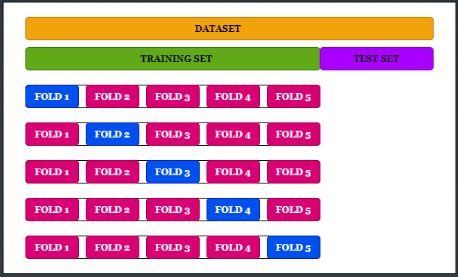
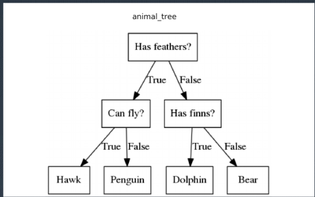
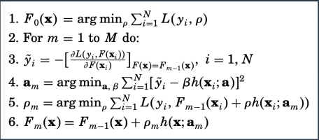

[TOC]

# 模型评估策略

**传统模型评估方法**

- 在传统模型评估方法中，数据集将会被分为三个部分：训练集、验证集（开发集）和测试集 
- 训练集目的：在给定超参数的情况下，对模型参数估计（训练）
- 验证集目的：选择超参数
- 测试集目的：测试最终选择的模型的真实表现

**为什么需要验证集**

- 我们可以考虑 $L_1$ 正则化的结果
- 对于训练集来说，最好的结果一定是 $L_1$ 正则化的惩罚系数为 0 的情况（思考题：为什么？ ）
- 在得到了训练集上根据某个正则化惩罚系数的情况下，在验证集上可以得到关于模型泛化性的一个相对客观的评价

**为什么不能用测试集替代验证集**

- 如果我们手头有测试集的结果，则从技术上而言，可以用测试集替代验证集的作用
- 但是这样做是非常危险的
- 我们虽然没有在测试集上直接拟合模型，但是通过测试非常多的超参数也近似的达到了效果
- 一个更极端的例子：如果加入测试集当中的只有正负样本，我们第一次将预测都设定为负样本，从第二次测试开始，我们每一次只改变其中一个测试。只要我们有足够多次的评估，我们就可以把正确的值推算出来
- 所以我们如果过多的在测试集上评价，则会高估测试集的效果

**前文评估方法的问题**

- 如果我们有极多的数据，那么上述方法还一般可行
- 但是通常情况下，我们可以得到的整体数据量是非常有限的
- 这种情况下，如果还要用之前的方法就会导致：
- 训练集的数据量不够，导致精度不够
- 验证集的数据量不够，导致验证准确性不强

**k-fold**



**关于 k-fold 的选择**

一般来说，k-fold 随机选取就可以

但是在一些情况下，k-fold 和 Test 集合在随机选取的情况下，仍然可能有很大的差别 

这种情况有可能是几种情况造成的：
- k-fold 本身的随机性
- 训练（验证）集和测试集本身的差异 
- 一般来说我们希望的是：尽可能保证 k-fold 结果和测试集一致

如果把所有的k-fold数据合并到一起训练，会存在一个很大的问题：对集成树模型会存在一个严重的问题，很多特殊的参数不知道如何选择，如树的个数。


**分布匹配的问题**

- 一般来说，我们希望训练、验证和测试集都来自于一个分布，但是这种假设经常被打破
- 比如对于时间序列来说，如果我们用 2019 年的经济数据来预测 2020 年经济数据，则大概率不会得到很好的结果
- 这种问题没有通用的良好解决方法，一般来说只有两种可能性：
  - 尽可能保证样本具有足够代表性：“北京样本收入估计全国” →“全国抽样估计全国”
  - 尽可能保证模型的多样性：模型集成

**模型集成基本思路：以二分类为例**

- 由于每个模型都有一定的长处和短处，所以尽可能用多个模型的共同结果来进行预测
- 最简单的模型集成：将一个数据集 k-fold 之后直接采用预测概率的平均
- 思考题：传统方法建议使用 k-fold 选择超参数，然后再使用同样的参数对所有的训练集进行训练并预测 → 这样的训练有什么问题？


**问题**

- 核心问题（之一）在于超参数的选择和观测数量有很大关系
- 如果我们改变观测数量，实际上也改变了最佳的参数
- 更糟糕的是，对于 GBDT 类模型，你不知道选取多少棵树作为最终模型
- 此外，多模型（请注意，k-fold 交叉验证在比赛中常常被称为单模型，但是它实际上是多模型），往往会比单模型更稳定

**更复杂的建模方法**

- 在（传统的）数据科学竞赛当中，通常会采用更复杂的模型平均策略 
- 很常见的一种策略是：以一个模型为基础，每次增加一个（通常都是数学形式不同的模型）
- 这样做的好处是可以不扔掉之前模型的效果

**AdaBoost 和残差学习**

- AdaBoost(Chengsheng, Huacheng, and Bing 2017) 的核心思想是训练两个模型，得到一个模型的预测之后，对于该模型预测较差的部分应该对之增加权重，而已经较好的部分则不需要特别的处理
- 这种方法和类似衍生方法在 2010 年左右十分火热
- 目前该方法基本已经被 GBDT 及相关模型所取代
- 但是，GBDT 类模型 + 神经网络 +AdaBoost 在很多实践当中效果很好

**多模型建模和单模型建模的技术方案选择**

- 三种方式：
  - 唯一的一个模型
  - 同样模型的 k-fold（在竞赛中也叫单模型）
  - 多个模型的复杂集成 
- 一般来说，需要考虑的是算力要求
- 通常来讲，在算力可以达到的时候，尽可能不要用单模型
- 传统人士认为单模型（尤其是线性回归和逻辑回归）比复杂模型更稳定，因为表现形式简单，这主要原因是在实践中，他们往往对比的不是做过k-fold 之后的模型
- 其他所谓可解释性的问题往往不是真正限制模型应用的，尤其是 SHAP值出现之后。相对来说，很多时候这里出现的是 “但求无过，不求有功”的心态

**是否选好变量就可以用很简单的模型**

- 一些所谓业务专家吹嘘自己因为懂业务，所以只要自己随便懵出来的模型，就可以比这些复杂的方法预测性更好
- 这是不可能的：没有任何一个业务专家可以在 Kaggle 上一次就凭借自己的经验，用逻辑回归得到 Kaggle 第一名，甚至我怀疑有任何业务专家能够一次性根据自己的经验进入到前 90%
- 核心问题在于，数据和业务真实之间的关系是非常复杂的。大部分专家的经验只对非常小的样本、非常少的变量和非常粗略的关系管用，但对于挖掘出来的数据的作用其实是很小的
- 例如违约预测问题，可以问专家：
  - 是否可以告诉我从收入区间每 50 元钱之间违约概率有什么不同？
  - 给定某用户三年内所有微信、支付宝银行卡等转账数据，是否可以告诉我哪些和收入有交叉效应？
- 结论：对于号称自己有业务专家支持的，应该引导做公平 POC。大部分专家预测结果，远远不如实习生乱做出来的模型效果好


**模型的可解释性问题**

- 正如前文所说：理论上好模型的可解释性和预测精度往往应该是相辅相成的
- 但是实际上，对于常见的所谓可解释的模型，其结果往往是互相矛盾的
- 原因在于常见的可解释模型，数学形式较为简单，但是带来的问题是，这些模型所得到的估计偏差较大。所以虽然可 “解释”，但是解释出来的结果是错的 
- 在 SHAP 值出现之后，我们发现如果从更复杂的模型中提取出真实的表现，实际比逻辑回归和线性回归对业务的解释更直观，见该[文章](https://towardsdatascience.com/black-box-models-are-actually-more-explainable-than-a-logistic-regression-f263c22795d?gi=3dfb4fcb49a)

**模型的鲁棒性**

- 鲁棒性是指模型在不同（来源）的数据集上表现应该尽可能一致
- 鲁棒性从原则上来说是没有办法根本解决的
- 但是一些方法可以提升模型的鲁棒性：
  - 采用多种形式的模型进行平均 
  - 小心进行数据预处理（删除掉过小的类别，对一些取值范畴进行限制等）

# 树模型和提升

## 决策树

**决策树模型**



**决策树的优点**

- 很好（？）的捕捉非线性效应和交叉效应
- 可解释性（？） 
- 贪婪算法使得收敛保证和计算快捷

**决策树的缺点**

- 准确率很差，并且难以提高 → 主要原因在于模型表现力不够
- 树的结构十分随机
- 各种调整参数的方法对于决策树的用处都不大
- 一般仅仅用于变量的离散化，实际上效果也不如其他模型（例如LightGBM）

**随机森林和 ExtraTrees**

- 核心思想：随机抽取部分变量和/或观测，分别拟合决策树
- 最终预测结果由投票决定
- 一般只支持离散或连续的预测值
- 通常为了保证速度，采用对 X 分箱后再寻找合适的节点（据说可以防止过拟合？）
- 一个重要的变种为 ExtraTrees(Geurts, Ernst, and Wehenkel 2006)，核心思路在于随机抽取分割点，然后再从分割点选取合适的

**随机森林类算法的优缺点**

- 优点：表现力远远强于单颗决策树，且可以很容易实现并行
- 缺点：树和树之间没有关联，通常根据一般情况定义一般的损失函数不是十分容易的

## GBDT/XGBoost/LightGBM/CatBoost

**GBDT 及相关系列**

- 相对于决策树来说，GBDT(Friedman 2001) 是一系列针对一般建模情况的算法
- 核心思想：根据上一轮的运算结果对模型进行补充

**GBDT 核心算法**



**GBDT**

- 虽然 GBDT 的文章出现较早，但是实际上刚开始并没有那么流行，这多少和 GBDT 消耗算力较大（在当时看来）有关
- GDBT 引入到公众视角是从使用 GBDT+LR 的方式做点击率预估开始的
- 目前在 GBDT 的基础上，主要有四个比较著名的提升：
  - XGBoost(Chen and Guestrin 2016)
  - LightGBM(Ke et al. 2017)
  - CatBoost(Prokhorenkova et al. 2017)
  - NODE(Popov, Morozov, and Babenko 2019)

```text
GBDT(Gradient Boosting Decision Tree)（梯度提升决策树）
定义：是为了解决一般损失函数的优化问题，方法是用损失函数的负梯度在当前模型的值来模拟回归问题中残差的近似值。
```

```text
在回归分析中，通常用残差分析来判断回归模型的拟合效果。
残差分析的两种方法：
1.通过残差图。若残差点比较均匀的落在水平区域中，说明选用的模型比较合适。带状区域的宽度越窄，说明模型的拟合度越高。
2.通过一般指数判断,如下图。一般R平方越大，残差平方和越小，从而回归模型的拟合效果越好。
```

```text
GBDT是把所有树的结论累加起来做最终结论的。
GBDT的核心就在于，每一棵树学的是之前所有树结论和的残差（负梯度），
这个残差就是一个加预测值后能得到真实值的累加量。
比如A的真实年龄是18岁，但第一棵树的预测年龄是12岁，差了6岁，即残差为6岁。
那么在第二棵树里面我们把A的年龄设为6岁去学习，比如第二棵树的结论是5岁，
则A仍然存在1岁的残差，第三棵树里面把A的年龄设为1岁去学习，继续学。
Boosting的最大好处在于，每一步的残差计算其实变相的增大了分错的instance的权重，
而已经分对的instance则都趋于0。
这样后面的树就能越来越专注那些前面被分错的instance。
```


**XGBoost 原理**

- 见XGBoost **官方文档**

**LightGBM 原理**

- 见Ke et al. (2017)

**CatBoost**

- 见Prokhorenkova et al. (2017)


# 线性模型


