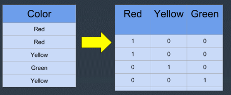
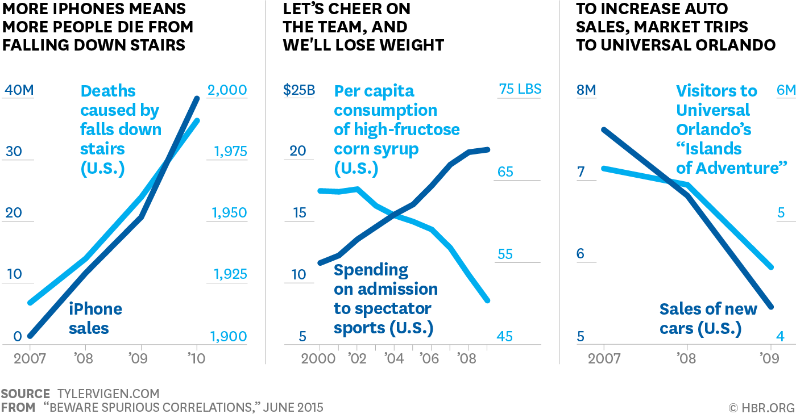
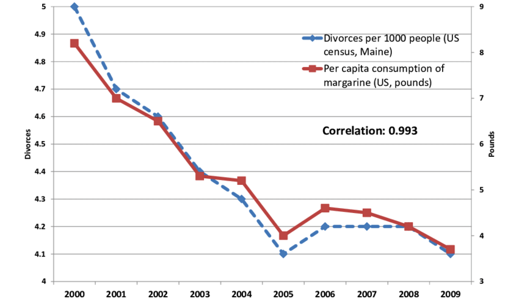
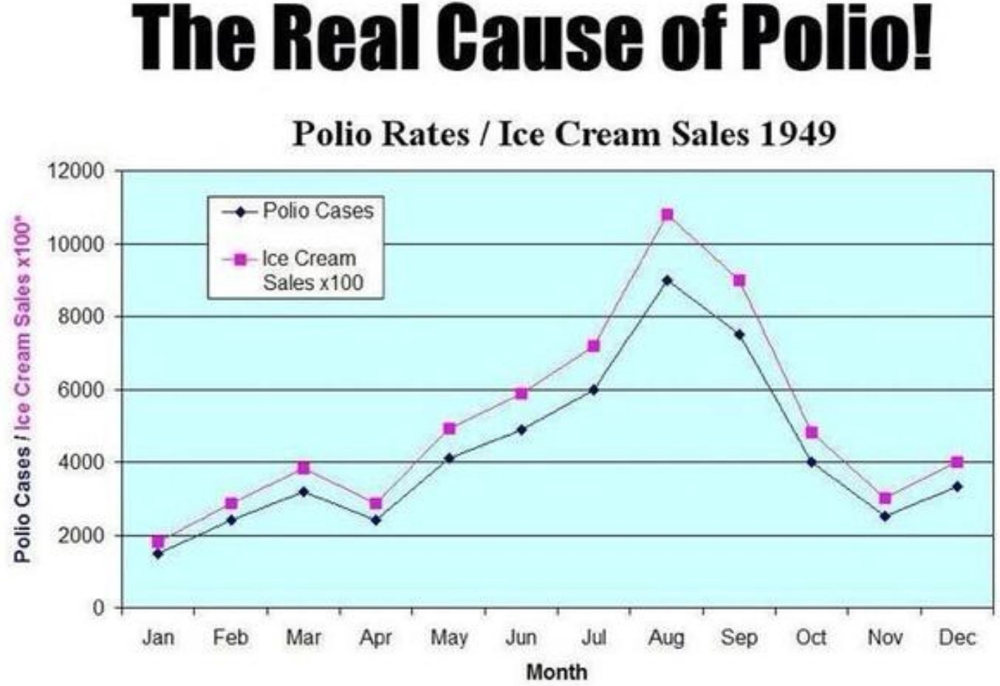
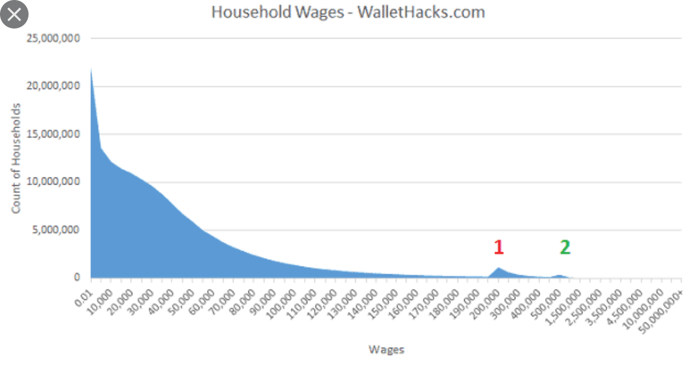
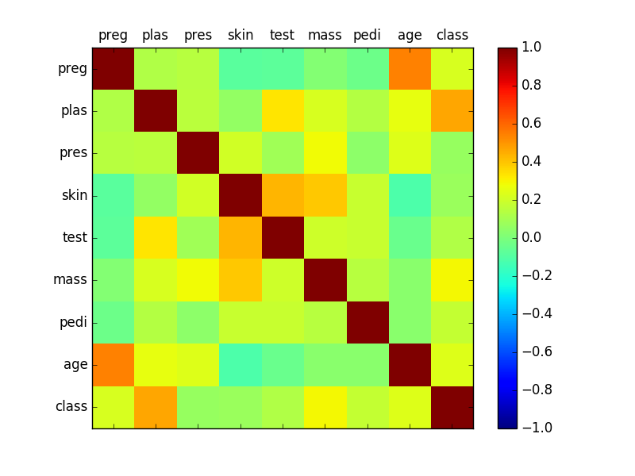

[TOC]

企查查 分析企业盈利，抽取特征数据

- 1.正面 vs. 负面
- 2.自己 vs. 其他
- 3.自己现在 vs. 自己过去
- 4.自己 + 关联
- 5.盈利种类
- 6.盈利 vs. 投入（人数、经营、项目）
- 7.方差  vs.  均值
- 8.员工盈利 股东
- 等等......

知识产权

- 1.宏观描述  vs.  微观描述、

- 2.文本特性  vs.  业务特性

  （长度 不同粒度 段落数 字数  词数 图片数）（关键词【标题 前几个段落】）

- 3.单篇文本  vs.  多篇文本 

- 4.质量文本

- 5.中文   vs.   英文

- 6.文本处理

# 概览

**核心内容**

- 构造变量的三种方法；
  - 基于业务理解；
  - 基于常见的构建模式；
  - 根据 EDA 和 Bad Case 分析。
- 选择变量的方法：
  - 算法内置的选择法；
  - 单变量相关的选择方法；
  - Permutation Loss 为基础的选择方法。

**在我们讨论构建变量之前…**

- 变量的构建和选择与我们采用的模型有很大关系；
- 以树为基础的模型和包含线性组合的模型有很大不同。
- 思考题：假设我们将某离散变量按照其出现频率进行排列（最常出现的给 0，次常出现的给 1 等等）。这样的编码形式是否适合以树为基础的模型？是否适合以线性数学表达形式为基础的模型？

事后变量

**为什么特征工程非常重要**

- 如果树模型或者神经网络模型可以认为是自动的特征提取器，为什么我们还需要手动构建特征呢？
- 可能的原因：
  - 模型未必能够把正确的关系找到；
  - 减少模型的估计复杂度。

**数据质量的一些说明**

- 在比赛中，一般来说数据集已经是清理好的；
- 但是在实际应用中，数据质量常常是非常糟糕的；
- 面对数据质量问题常常需要有深刻的业务理解，加上 EDA 和多源头检查同时进行；
- 处理数据质量问题往往只能依靠数据源头配合；
- 幸运的是：在一些情况下，即使数据质量很差，预测性建模仍然可以找到一些有效的模型；
- 注意部署的问题：防止新输入模型的变量出现奇怪的异常值。

**构造变量和选择变量**

- 不论是构造变量还是选择变量，都要通过公平的比较才可以进行；
- 通常来说，构造变量是比较容易的，但是如何构造出有效的变量是非常困难的；
- 在比赛中，构造变量通常是一个个进行的（除非时间有限制），但在实际工作中，构造变量常常是成块成块进行的；
- 最常见的模式是：尝试对一系列具有类似业务解释的变量进行构建，然后对整体有效果的变量进行集中构建，在变量个数达到一定数量的时候，进行一定的变量选择；
- 很遗憾的是，目前还无法总结出一个共性的变量构建流程。

# 基于业务的特征构建方法

**核心原则**

- 即使是在之前建模中总结出来的有效变量，在换了一个场景之后，可能仍然是无效的；
- 所以预先通过 “业务理解” 找到黄金变量是不大可能的；
- 业务理解更多的是通过多种角度出发，构建可能的变量。

# 常见的特征构建方法

## 单变量：离散

**one-hot**

**one-hot 注意事项**

- 有一些 one-hot 的变种对于预测性建模影响不大；
- 对于树模型，一般不需要去掉其中一列；
- 对于线性模型，一般需要去掉其中一列；
- 有时当类别极多时候，可以合并一些出现比较少的类别。

**Target Encoding**

- 核心思想：通过预测值的平均值替代该变量；
- 核心问题：target leakage、类别内的异常值；
- 解决方法：leave-one-out encoder、将类别均值和整体均值进行加权估计、CatBoost encoder 等等
- 对于高维稀疏类别常常非常有效。

**Count Encoding 和 Freq Encoding**

- 用该类别出现的次数（频率）替换该变量；
- 合并训练集和测试集之后再计算（不要单独计算）。

**关于 Ordinal Encoding**

- 不同实现对于 Ordinal Encoding 有不同的说法；
- 但是一般来说，Ordinal Encoding 仅仅是把类别映射成不同的整数而已，并且类别与整数的映射是随机的；
- 从这个角度来说，单独的 Ordinal Encoding 不宜直接应用在建模当中。

## 单变量：连续

**对于树模型和线性模型的一些说明**

- 对于 XGBoost 和 LightGBM 来说，在选择树的分割点时，模型只关心顺序；
-  所以理论上来说，保序或者倒序的变换不会对模型拟合结果产生影响；
- 对于线性模型，情况比较复杂：
  - 对于线性回归和逻辑回归而言，线性变换理论不会改变其模型效果，但是从数值解法的角度来说，不需要变量中出现过大或者过小的现象；
  - 如果带有惩罚项，则要保证量纲的一致；
  - 对于 SVM，需要进行标准化。
- K-NN 显然需要进行标准化（除非采用不受标准化影响的距离）。

**一些常见的变换**

- 多项式（n 次方）；
- 指数和对数；
- 倒数（注意 0 和接近 0 的值）。

**异常值的发现和处理**

- 这里所说异常值，往往指特别大和特别小的值；
- 在一些情况下，这些值的出现可能是合理的，但对于构建模型却没有什么帮助；
- 问题往往在于无法对异常值做非常具体的判定；
- 几种处理异常值的方法：
  - 将该观测去除；
  - 截断（尝试采用不同的截断方法）；
  - 赋值为缺失值。

**缺失值处理**

- 对于树模型，模型本身就可以处理缺失值；
- 对于线性模型，如果不希望将该观测丢弃，则需要采取填充的方法；
- 简单的填充方法（如中位数填充）往往已经够了；
- 一些复杂的填充方法如 MICE 可以在 R 当中实现；
- 对于非常重要的含有缺失值的变量，可以采用 LightGBM 进行预测。

**正态化（？）**

- 一些人认为将变量变为正态变量是有必要的，而一些人认为这么做是非常愚蠢的；
- 实际应用中，我没有发现任何理论支持其中任意一种观点。
- 思考题：如何将任意一种观测都变成正态分布？
- 其他方法：Box-Cox 变换和 Yeo-Johnson 变换，见[该文档](https://en.wikipedia.org/wiki/Power_transform)。

**离散化**

- 一定会丢失信息。
- 常用方法：
  - 均分；
  - 分位数；
  - 基于树模型；
  - 基于聚类分析（效果往往不好）。

## 双变量：连续和离散

**Group By**

- 可以看作是两个变量之间的交叉效应；
- Group By 的操作可以是任何的 summary statistics（如 mean，median，max，min，range，moment 等等）。

## 双变量：连续和连续

- 一般来说，这种处理都会有业务逻辑支撑；
- 最常见处理：乘和除。

## 双变量：离散和离散

- 唯一方法：直接构建交叉效应

## 其他方法

- Row summary statistics；
- 将模型的结果输入到另一个模型中；
- Isolation forest；

# EDA、BadCase 和 SHAP 值分析

**最大问题：Spurious Correlation**

**结论**

- 相关性不等于因果性；
- 单变量相关性不是真实的相关性。

## 对变量自身的检查

**对 y 值的检查**

- 分布是否合理？是否存在偏态分布？是否存在异常值？
- （对于分类）是否存在分布极为不均衡的现象？
- 是否存在可能的错误编码？
- Homogeneity vs. Heterogeneity
- 是否存在奇怪的现象？

**美国家庭收入**

**思考题**

从上图中，我们可以看到什么？

**处理建议**

- 对于 y 值呈严重偏态分布的，可以考虑采用多种方法将之处理成类似于对称的数据并作拟合（有争议）；
- 对于 y 值和其他非常重要的变量，有两个选择：
  - 搞清楚异常值出现的原因；
  - 先不管异常值出现的原因，先拟合模型并检查实际的拟合效果；
- 很多样本是由很多小样本组构成的，这可能意味着我们构建的模型并不一定适应这部分样本。

**对 X 值的检查**

- 与 y 自身的检查类似；
- 注意检查缺失值的问题。

**Correlation Graph**

上图来源于[这里](https://machinelearningmastery.com/visualize-machine-learning-data-python-pandas/)，请问这张图当中潜在问题在哪里？

**问题 1：离散变量和连续变量的处理**

- 理论上来说，只有符合正态分布的连续变量才可以计算;
- 不符合正态分布的连续变量，可以使用 Spearman Correlation，见[scipy对应包](https://docs.scipy.org/doc/scipy/reference/generated/scipy.stats.spearmanr.html)
- 对于离散和连续变量，理论上来说我们可以有其他的相关性系数，但是更为靠谱的是将连续变量分箱后展现成列联表

**列联表**

|        | Dog  | Cat  | Total |
| ------ | ---- | ---- | ----- |
| Male   | 42   | 10   | 52    |
| Female | 9    | 39   | 48    |
| Total  | 51   | 49   | 100   |

- 实现可以采用Pandas CrossTab
- 优点：
  - 可以处理任何变量；
  - 可以揭示（？）非线性效应；
- 问题：
  - 如何分箱？

**问题 2：两两关系之上**

- 为什么要研究 X 变量之间的关系 → 我们希望知道哪些变量之间是高度相似的；
- 由于高度相似变量包含的信息往往是类似，如果我们过度对一类变量进行挖掘，很可能就忽略了其他可能性（？）；
- 但是假设 A 和 B 高度相关，B 和 C 高度相关，是否意味着 A、B、C 三个变量可以是一组的呢？
- 进一步的，X 变量之间的关系是什么？

**Bayesian Networks**

- 见Scutari and Lebre (2013)。
- 具体代码见 colab。

## Y和X之间的关系

**事后变量举例**

- 使用所剩还款判断是否违约；
- 使用违约信息（法院公示、劳动纠纷等等）判断是否已经违约；
- 使用存款判断对额度的需求；

**识别事后变量**

- 理论上，事后变量只能通过业务进行排查；
- 实际上，往往引发事故的变量是会对预测准确度有极大提升的；
- 发现方法，先拟合模型，然后检查是否有个别变量可以极大地提升准确性。

- 注意 Spurious Correlation；
- 注意缺失值和 Y 之间的关系；
- Y 是连续时 → 散点图；
- Y 是离散时 → boxplot。

**Bad Case 分析**

- 不宜过早进行 Bad Case 分析；
- Bad Case 分析第一步：比较” 预测好” 的和” 预测不好” 的观测值在各个表现上的分布区别；
- Bad Case 分析第二步：比较 SHAP 值的表现。

**SHAP 值的定义**

- 见Lundberg and Lee (2017)

**SHAP 的使用**

- 见 [该 Kaggle Kernel](https://www.kaggle.com/cast42/lightgbm-model-explained-by-shap) 和 [该文章](https://towardsdatascience.com/explain-any-models-with-the-shap-values-use-the-kernelexplainer-79de9464897a)

# 变量选择

**变量选择的三种方法**

- 单变量的选择；
- 基于模型的选择；
- Permutation Loss。

**单变量选择**

- 一一计算 X 和 Y 之间的” 相关程度”；
- 根据” 相关程度” 进行排序；
- 适用于大量变量做初筛的时候；
- 问题：
  - Spurious Correlation；
  - 只要观测足够多，一定是显著的。

**基于模型的选择**

- L1-penalty、树模型当中的各种方法；
- 与模型高度相关；

**Permutation Loss**

- 每次对一个变量进行变换（训练集随机打散），重新拟合模型，并检查预测精度的损失；
- 损失越大，说明该模型越重要；
- 思考题：这种方法的局限性在哪里？

# 参考文献

- Lundberg, Scott M and Su-In Lee (2017). “A unified approach to interpreting model predictions”. In: Advances in neural information processing systems, pp. 4765–4774.
- Scutari, M and S Lebre (2013). Bayesian networks in R: with applications in systems biology.

