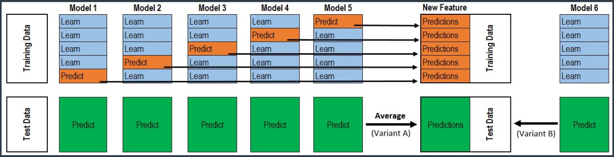
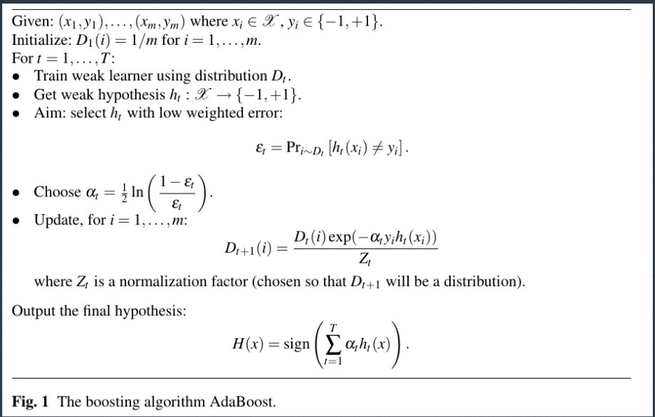

[TOC]

# 集成学习的目的

**集成学习的简介**

- 最简单描述：将多个模型的结果合并到一起进行预测；
- 一般来说，仅仅在预测性建模当中使用；
- 流行主要原因是数据科学竞赛；
- 但是其流行程度在逐渐减弱。

**思考题**
集成学习为什么会有效？

**集成学习为什么有效**

- 目前来说，很不幸我们还不清楚为什么集成学习会有效果；没有（？）相应的理论证明，只有实践支持；
- 几种常见的理由：
  - Error Correction Encoding；
  - “各取所长”；
  - 过拟合；

**Error Correction Encoding**

- 假设原始的（正确的）encoding 为 1110110011；
- 为了保证信号传输的正确，我们选择用三次 encoding 来记录实际的信号：
  - 1010110011；
  - 1110110011；
  - 1110110011。
- 则三者投票之后，结果仍为正确的 encoding。

**小练习**
假设每位密码被污染的概率是 10%，那么假设密码有八位，最终解码正确的概率是？

**“各取所长”**

- 假设我们将数据分为三种：非常容易预测的、有一定难度的、非常难以预测的；
- 对于非常容易预测的，大部分模型都能预测对；
- 对于非常难以预测的，大部分（或者全部）模型都无法预测；
- 其他的观测是我们争取的重点，如果我们能够找到权重合适并可以加权求和得到结果，帮助我们综合各个模型的优点，则理论上我们可以得到较好的结果。

**对于集成学习的启示**

- 被集成的模型应该有一定的准确性；
- 被集成的模型应该在预测上有一定的区分。

**区分的作用**

- 假设我们的真实结果都是正样本；
- 假设我们的三个模型预测结果为：
  - 1111111100；
  - 1111111100；
  - 1011111100；
- 则最终结果为 1111111100，准确度为 80%。

- 假设我们的真实结果都是正样本；
- 假设我们的三个模型预测结果为：
  - 1111111100；
  - 0111011101；
  - 1000101111；
- 则最终结果为 1111111101；准确度为 90%。
- 当然这个例子是人为构建的。

**过拟合的角度**

- 尝试使模型过拟合；
- 这一点最为反常识；但是考虑在很多预测性建模例子当中，很多“最好”的模型都是严重过拟合的；
- 从稳定性角度来说，有宣称为过拟合的模型更不稳定，所以不应该使用集成学习；
- 但是由于不同类型的模型可能能够抵御不同的异常情况，所以反而可能增加模型的准确性；
- 这在数据信息量较小的情况下尤其有意义。

**竞赛的角度**

- 竞赛中提交次数是有限的，加之提交有一定的随机性；
- 竞赛中一般只取最好的结果，而不是看最终的提交；
- 所以如果能知道怎样可以猜到一个有效的提交是很重要的摸奖条件；

# 基本集成学习方法

## 集成学习的重要选择

**是否要进行集成学习**

- 竞赛：基本答案是“是”。
- 实际建模：核心考量 → 建模效率和推断效率，后者尤其重要。

**何时开始集成学习**

- 早开始的优点：可以看到实际模型的效果、充分利用提交次数、充分利用已有模型效果；
- 早开始的问题：过多算力浪费、过多精力浪费、思维定式。

**将哪些模型进行集成：预测不同的来源**

- 不同的模型结构 → 最常见；
  - 可来自于模型数学形式不同、训练方式不同甚至初始化不同；
- 不同的数据：
  - 不同的数据扩充结果 → 非结构化数据非常常见；
  - 去掉不容易预测变量之后的结果 → 比较罕见；
- 不同的变量：一般只有不同的人员在表格化竞赛中才会使用。

**将哪些模型进行继承：子模型选择**

- 自模型选择跟集成方式有关: 一般来说，集成方式越复杂，则对于被集成模型的输入要求越小；
- 一般要求：
  - 同样模型选预测准确度高的；
  - 不同模型预测准确度应该一致，并且有一定区别；
  - 预测粒度尽可能一致。

## 加权求和

**算数平均**

- 最基本的方法：直接取算数平均值；
- 需保持预测粒度一致；
- 需保持模型的可信度类似。

**其他方法**

- 几何平均；
- 根据排序进行平均。

**权重**

- 权重的确定可能非常具备随机性；
- 举例：五个模型中，最好的模型 3 票，其他模型各 4 票；
- 在 stacking 的最后一层，常常采用类似的方法。

## Stacking

**基本思路**

- 使用模型的预测结果作为输入并进一步进行预测；
- 目的（之一）：过拟合训练集；
- 问题：为什么不能直接用训练集结果进行预测？

**Stacking 基本图示**



**Stacking 所使用的模型**

- 在最后一层，一般采用逻辑回归或者简单加权平均；
- 在中间，一般非线性的模型比线性模型效果更好；
- 同时，非线性模型不应该过于复杂。

# 一些其他的尝试

**Adaboost**



**Stacking 中 Meta-feature 的引入**

- 一般来说，将模型预测结果跟原始模型的变量同时输入模型是一个不太合适的选择（容易导致过拟合）；
- 但是将降维后的变量引入模型可能效果比较好；
- 常见的降维方法：tSNE+KNN。
- 可以将模型预测当作是普通的变量使用；
- 二阶的特征可能起到很大作用；
- 预测层级之间的差异可能起到很大作用。

**Stacking 当中的随机调参**

- 一般来说，stacking 当中都会选取效果最好的参数；
- 另一种思想是：不选取效果最好的模型，只纯粹做随机调参（但是需保证随机调参的基本质量）；
- 可以作为 stacking 当中的一个输入；
- 耗费大量计算资源，一般只在比赛当中使用。

**宽表**

```
[x for x in train.columns.to_list() if x.startswith('continuous')]
```

`train['loan_status'].value_counts()`

`test['loan_status'].value_counts()`


