[TOC]

- 神经网络建模过程；
- 神经网络常见元素；
- 神经网络常见设计模式。

**神经网络与经典模型不同之处**

- 随机函数与再现性；
- 验证集和模型选择。

**神经网络和生物科学**

- 在大部分时候，神经网络和人脑的神经构成有很大区别；
- 相关文章一般会习惯性的将一些设计模式赋予生物学意义；
- 还有一些文章将一些生物学的发现作为 motivation；
- 但是从生物学出发并不意味着神经网络就一定比其他模型更优越，这一点在表格化数据当中非常明显。

**关于神经网络的学习**

- 大部分时候，神经网络的学习只能通过阅读 paper（不建议阅读二手材料）和复现的方式；

**阅读 paper 和复现**

- （大部分时候）阅读 paper 面临的问题是读不过来而不是没得读的问题；很多 paper 的结果很难复现；
- 寻找有效 paper 的主要途径：Survey 和高规格比赛；
- 将一篇知名 paper 研究透彻比随意浏览若干篇有更大帮助。

**阅读 paper 的过程**

- 摘要；
- 实验结果：用于判断 paper 的实际效果；
- 方法论 + 代码：注意观察不太常见的设计、注意很多实现可能有错误。

**paper 的复现**

- 复现的原因：
  - 找到 paper 当中实际有效和无效的部分；
  - 纠正错误的实现；
  - 对 paper 进行改进。
- 大部分时候，不要自己从头来写。

# 神经网络优化过程

**自动后向传导对建模逻辑的影响**

- 建模者很容易调整模型的数学形式；
- 由于目标从构建始终有效的模型变为只需要对当前数据集有效的模型，这使得神经网络的架构创新变得十分重要。

**梯度爆炸和梯度消失**

- 由于后向传导的存在，使得如果某一层出现梯度爆炸和梯度消失的现象，那么很可能之前的层也有遇到同样的问题；
- 这是神经网络设计模式当中需要解决的最重要的问题之一。

**神经网络的初始化**

- 一般采用随机初始化；
- 分布：均匀分布和正态分布；
- He Initialization (He et al. 2015)；
- 一般来说，如果怀疑初始化有问题，只能调试方差。

**神经网络的经典优化器**

- SGD 和 SGD+Momentum；
- Adagrad 和 Adam；
- 如果不需要精细调参，一般来说可采用 Adam；
- 对于卷积神经网络（CV 应用），SGD+Momentum 常常效果更好。

# 神经网络常见元素

**激活函数**

- 由于线性函数的组合仍然为线性函数，所以一般来说需要进行非线性变换；
- 问题：什么样的非线性变换是合适的？

**sigmoid 和 tanh 是否适合作为激活函数？**

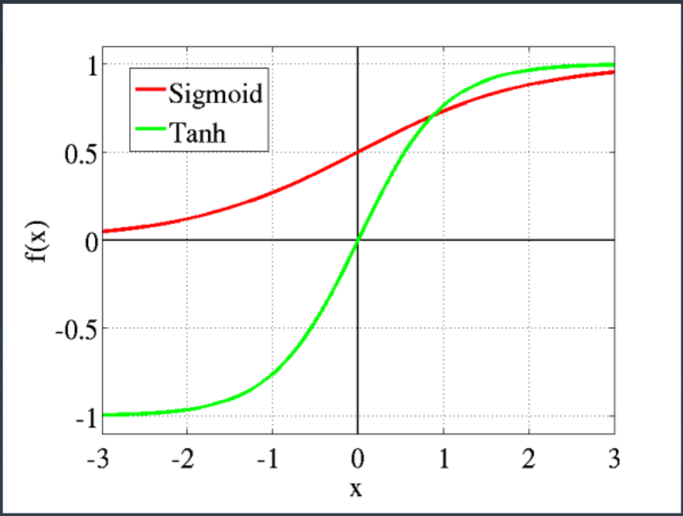

**ReLU**

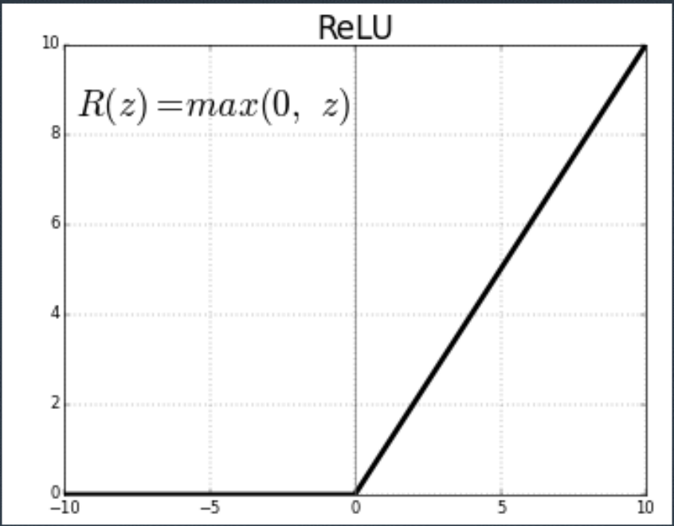

**Leaky ReLU 和 PReLU**

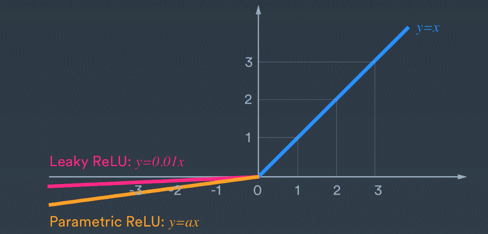

**ELU 和 GeLU**

- ELU：在 x ≥ 0 时和 ReLU 一样，当 x < 0 时为 $\alpha(e^{\alpha x}− 1)$；
- GeLU：$f(x) = x\Phi(x)$​​，其中 $\Phi(x)$​​ 为正态分布的 CDF。

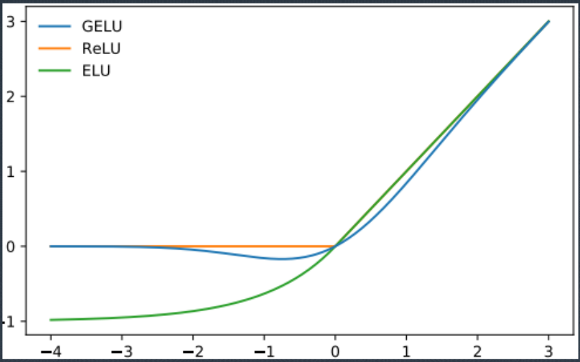

**Swish**
数学形式：$\sigma(x)$

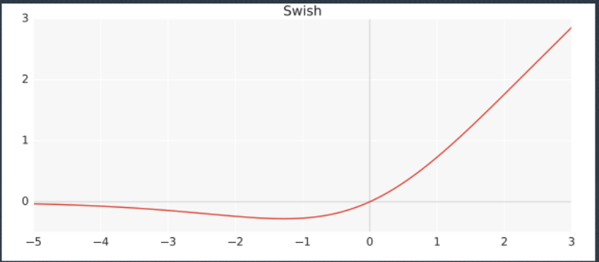

**mish**
数学形式：$xtanh(log(1 + e^x))$

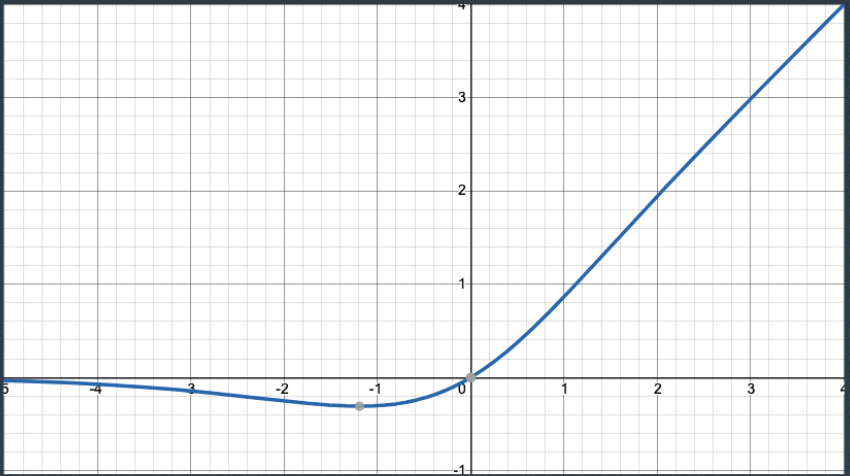

**激活函数经验总结**

- 在很多时候，使用什么激活函数一般是由预训练模型决定的；
- 并没有任何研究表明一种激活函数比另外一种激活函数系统性更优；
- 如果从头训练，建议尝试使用不同的激活函数。

**Batch Normalization 出发点**

- 为简化问题，考虑 ReLU 激活函数；
- 我们希望输入应该在 0 周围；
- 我们希望输入不应该太大或太小；
- 直接方法：标准化
- 问题：直接进行标准化会出现什么问题？

**Batch Normalization**

- 设定一个真实的位置和方差参数，并进行估计；
- 好处：在需要还原的时候，可以将输出进行还原；
- 数学形式：$\hat{X}_i = \gamma\frac{x_i - \mu_i}{\sqrt{\sigma^2_i + \epsilon}} + \beta$

**BatchNormalization 的一些问题和提升方法**

- 既可以使用在激活函数前，也可以使用在激活函数后；
- Layer Normalization，Instance Normalization 和 Group Normalization；
- Ghost Batch Normalization；
- 训练和推断不一致的解决方法；
- 详见Summers and Dinneen (2019)。

**Dropout**

- 思想：每次随机丢弃一些神经元；
- 可以在 Normalization 之前或者之后；
- 效果有限，过大或过小都会导致训练无效。

# 常见神经网络设计

## CV

**卷积(convolution)**

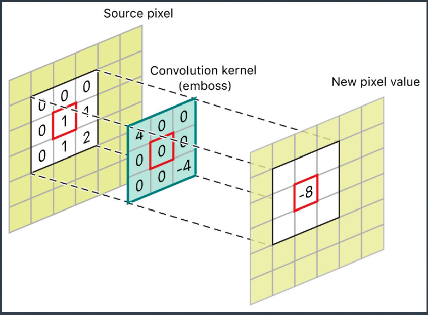

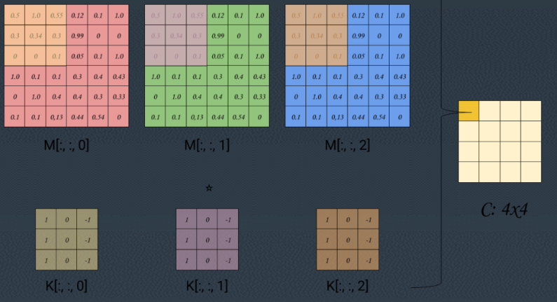

**卷积的参数**

- stride
- padding
- dilation

**Pooling**

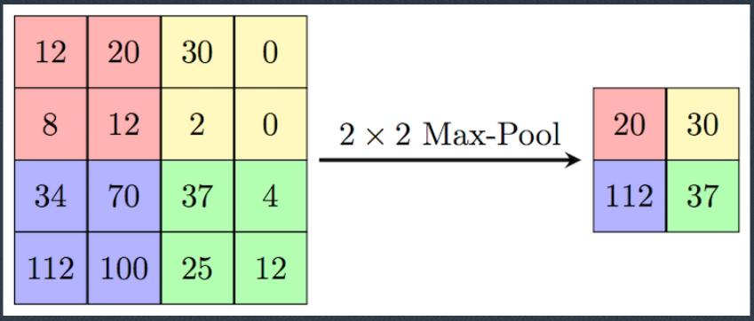

**Residual Connection**

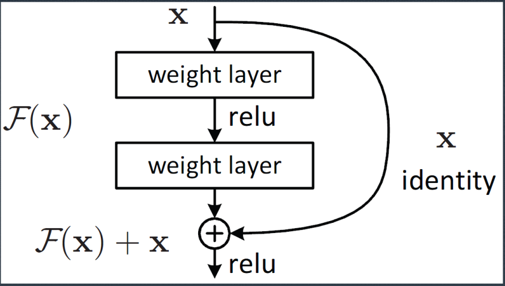

**Dense Connection**

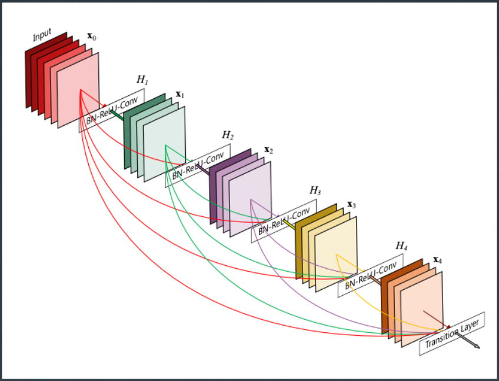

**其他 Residual Connection**

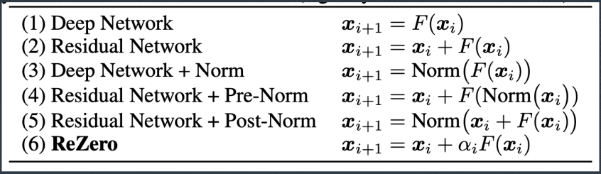

**Network-in-network**

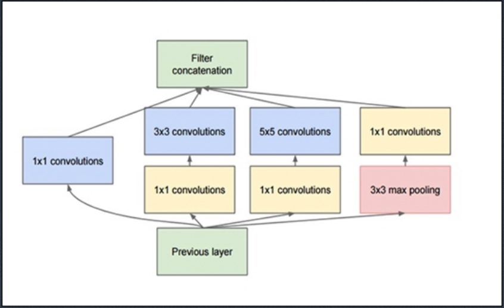

**Pyramid Network**

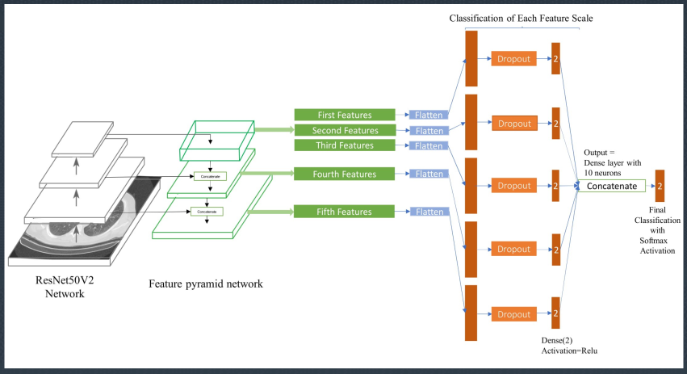

**SENet**

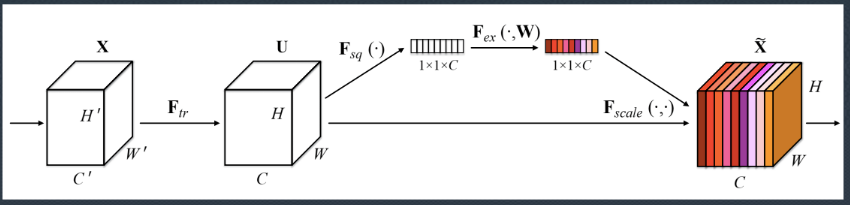

**关于 CV 的网络设计的总结**

- CV 领域是网络设计十分丰富的领域；
- 基本网络设计可以从 Image Classification、Object Detection 和 Image Segmentation 应用当中寻找。

## NLP

**思考题**

- 自然语言数据和图像视频数据有什么不同？
- 这对于网络设计有什么影响？
- 这对于整体算法设计有什么影响？

**自然语言数据核心问题**

- 自然语言数据本质上是离散的；
- 而神经网络一般对于处理离散稀疏的问题效果不好；
- 需要将离散的数据映射成为连续的数据。

**Embedding**

- 数学形式：将某一种离散变量映射成一个连续的（固定维度的向量）；
  - 举例：“中国”→[0.1,0.2,0.5,-2.3]
- 思考题：为什么 Embedding 和 one-hot 编码后再进入到全连接层是等价的？
- 核心问题：如何得到 Embedding → 第十一章将会详细解释；
- NLP 当中的一种常见思路是：如果一个词/字周围表达形式类似，则其Embeddding 应该也是类似的。

**RNN 的问题**

- RNN 的问题之一：容易出现梯度爆炸和梯度消失问题；
- 传统解决方案：LSTM 和 GRU。

**LSTM**

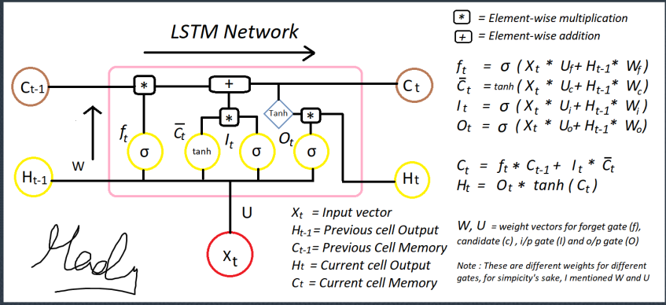

**RNN 的问题**

- RNN 的问题二：运算效率低；
- 连带问题：难以构建很深的网络。

**Attention**

- 假设上一层的输入为 $x, y$​；
- 并不是对于所有的 $x$​ 来说，其影响都一样；
- Attention 最一般（？）的形式是$\sum_i f_y (y_i)x_i$​​ ，其中 $\sum_i f_y (y_i)=1$​​；
- NLP 领域当中，Transformer 出现之前 Attention 已经有很多应用，但是Transformer 的出现彻底改变了 Attention 在 NLP 以及相关领域当中的位置。

**Transformer**
细节见Vaswani et al. (2017)。

**Transformer 的后续工作**

- 一些改进 Transformer 的工作，如 Transformer-XL(Dai et al. 2019)，Evolved-transformer(So, Le, and Liang 2019) 等，实际证明对于效果提升并不大；
- 另一些工作着眼于减少 Transformer 的计算耗费，比如说 Albert(Lanet al. 2019)，Performer(Choromanski et al. 2020)。前者权重共享的思维在很多应用当中都可以使用，而后者则未必能达到理想的精度。

**Embedding，RNN 和 Transformer 在表格化数据挖掘中的使用**

- Embedding 和 RNN 均可以用在有时序信息的应用中；
  - Embedding 经常在通过类似于 word embedding 训练后，再插入到其他算法中（例如 LightGBM）；
  - RNN 类一般直接作用于时间序列数据，但是效果不一定非常理想；
- Transformer 在一些研究中（在 TabNet 出现之前），经常被认为是最好的应用于表格化数据的深度学习模型。

**Attention 一个其他的应用：Mixture-of-expert**
见Ma et al. (2018)

## GNN

**图网络的一些基础概念**
见Battaglia et al. (2018)

**图网络的复杂性**

- 图网络的应用和分类极其繁复；
- 如果要讲清楚所有图网络的应用，可能会耗费半年的课程；
- 在这里我们仅仅讲解一个重要的设计，Graph Attention Network(Veličković et al. 2017)。

## 其他应用

**MAC**
见Hudson and Manning (2018).

## 结构化数据应用现状
- 整体来说，结构化数据深度学习的进展远远没有 CV 和 NLP 领域进展迅速；
- 目前认为最好的 TabNet 在实证中并不如 LightGBM；
- 传统的 CTR 数据预测模型在使用中发现效果常常不太理想，（可能）原因之一是因为标准数据集和实际数据集相差较大。

**经典 CTR 模型：xDeepFM**
见Lian et al. (2018)。

**经典 CTR 模型：AutoInt**
见Song et al. (2019)。你会发现一个脸熟的模型。

**其他 CTR 模型**

- CTR 模型有很多，可见https://paperswithcode.com/task/click-through-rate-prediction。
- 问题：
  - 大部分 CTR 模型在结构化数据中表现并不理想，通常认为比较理想的只有 xDeepFM 和 AutoINT；
  - 由于目前并没有很统一的结构化数据 Benchmark 集合（类似于 GLUE 等等），导致结构化数据的比较并不公平；
  - 很多其他的 CTR 模型需要借助其他业务场景的知识。

**TabNet**
见Arik and Pfister (2019)。阅读该文章时候，请考虑以下问题：

- 该 paper 的实证研究是否有问题？
- 该 paper 的设计模式中是否有反常的地方？
- 该 paper 的设计模式中是否有不合理的地方？
- 该 paper 是否有提升的可能性？

# 参考文献

- Arik, Sercan O and Tomas Pfister (2019). “Tabnet: Attentive interpretabletabular learning”. In: arXiv preprint arXiv:1908.07442.
- Battaglia, Peter W et al. (2018). “Relational inductive biases, deep learning, andgraph networks”. In: arXiv preprint arXiv:1806.01261.
- Choromanski, Krzysztof et al. (2020). “Rethinking attention with performers”. In:arXiv preprint arXiv:2009.14794.
- Dai, Zihang et al. (2019). “Transformer-xl: Attentive language models beyond a fixed-length context”. In: arXiv preprint arXiv:1901.02860.
- He, Kaiming et al. (2015). “Delving deep into rectifiers: Surpassing human-level performance on imagenet classification”. In: Proceedings of the IEEE international conference on computer vision, pp. 1026–1034.
- Hudson, Drew A and Christopher D Manning (2018). “Compositional attention networks for machine reasoning”. In: arXiv preprint arXiv:1803.03067.
- Lan, Zhenzhong et al. (2019). “Albert: A lite bert for self-supervised learning of language representations”. In: arXiv preprint arXiv:1909.11942.
- Lian, Jianxun et al. (2018). “xdeepfm: Combining explicit and implicit feature interactions for recommender systems”. In: Proceedings of the 24th ACM SIGKDD International Conference on Knowledge Discovery & Data Mining, pp. 1754–1763.
- Ma, Jiaqi et al. (2018). “Modeling task relationships in multi-task learning with multi-gate mixture-of-experts”. In: Proceedings of the 24th ACM SIGKDD International Conference on Knowledge Discovery & Data Mining, pp. 1930–1939.
- So, David, Quoc Le, and Chen Liang (2019). “The evolved transformer”. In: International Conference on Machine Learning. PMLR, pp. 5877–5886.
- Song, Weiping et al. (2019). “Autoint: Automatic feature interaction learning via self-attentive neural networks”. In: Proceedings of the 28th ACM International Conference on Information and Knowledge Management, pp. 1161–1170.
- Summers, Cecilia and Michael J Dinneen (2019). “Four things everyone should know to improve batch normalization”. In: arXiv preprint arXiv:1906.03548.
- Vaswani, Ashish et al. (2017). “Attention is all you need”. In: arXiv preprint arXiv:1706.03762.
- Veličković, Petar et al. (2017). “Graph attention networks”. In: arXiv preprint arXiv:1710.10903.

